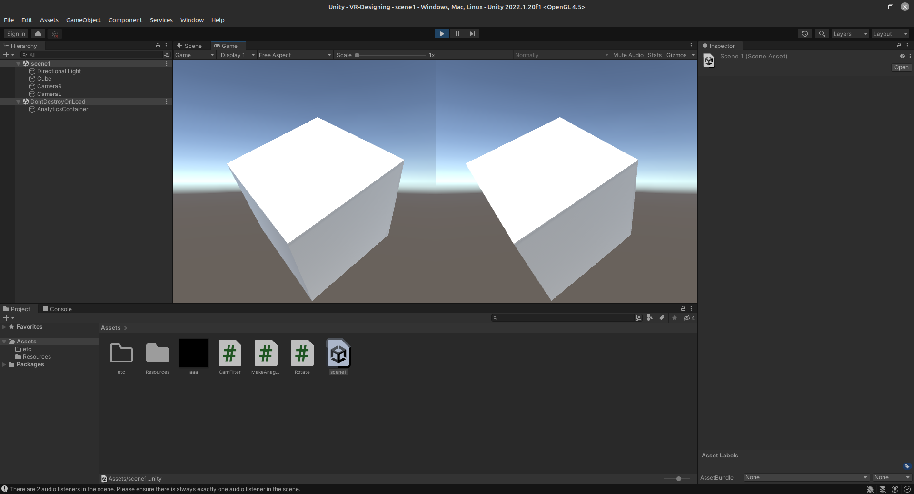

# VR Designing
Unity is a great tool for designing virtual reality experiences because it is cross-platform and allows developers to easily create interactive 3D experiences with a range of powerful tools. Its extensive library of assets, prefabs, and plug-ins make it easy to create amazing VR experiences without having to write a lot of code. Additionally, its support for a variety of game platforms and its wide range of developer tools make it one of the most popular game engines in the industry. Unity also offers a range of tutorials and support for developers who are just getting started with creating virtual reality experiences.

## Unity Installation Steps
1. Download and install Unity Hub from the Unity website.
2. Open Unity Hub and log in with your Unity account.
3. Select the version of Unity that you want to install.
4. Select the components you want to install.
5. Click “Install” and wait for the installation to finish.
6. Once the installation is complete, you can launch the Unity editor.

## Source code description in C Sharp

```csharp
using UnityEngine;  
using System.Collections;  
  
public class CamFilter : MonoBehaviour {  
  
   // Use this for initialization  
   void Start () {  
     
   }  
     
   // Update is called once per frame  
   void Update () {  
     
   }  
  
    void OnRenderImage(RenderTexture src, RenderTexture dest)  
    {  
        Texture2D LT2d = new Texture2D(src.width, src.height);  
        RenderTexture.active = src;  
        LT2d.ReadPixels(new Rect(0, 0, src.width, src.height), 0, 0);  
        LT2d.Apply();  
  
        Color[] Lpix =LT2d.GetPixels(0, 0, LT2d.width, LT2d.height);  
        for (int i = 0; i < Lpix.Length; i++)  
        {  
              
            Lpix[i].r = 0;  
              
        }  
  
        Texture2D Atext = new Texture2D(LT2d.width, LT2d.height);  
        Atext.SetPixels(Lpix);  
      Atext.Apply ();  
  
      Graphics.Blit(Atext, dest);  
    }  
}
```
This code is a MonoBehaviour script attached to a Camera gameobject. It is used to create a filter for the camera.
The OnRenderImage method is called after the camera has rendered the scene, and it takes two parameters - src and dest.
The src parameter is the source RenderTexture which contains the scene as rendered by the camera, while the dest parameter is the destination RenderTexture which will be used to display the scene.

The code then creates a new Texture2D from the source RenderTexture. It reads the pixels from the source RenderTexture, and then sets the red component of each pixel to 0. Finally, it creates a new Texture2D from the modified pixel array, and then uses the Graphics.Blit method to copy the texture to the destination RenderTexture.

```csharp
using UnityEngine;  
using System.Collections;  
  
public class MakeAnaglyph : MonoBehaviour {  
  
   public Camera cameraL;  
   public Camera cameraR;  
   RenderTexture LT;  
   RenderTexture RT;  
   Texture2D LT2d, RT2d;  
   Color[] Apix;  
   Texture2D Atext;  
  
   // Use this for initialization  
   void Start () {  
        
      LT = new RenderTexture(1024, 512, 16, RenderTextureFormat.ARGB32);  
      RT = new RenderTexture(1024, 512, 16, RenderTextureFormat.ARGB32);  
      cameraR.targetTexture = RT;  
      cameraL.targetTexture = LT;  
  
      LT2d = new Texture2D(cameraL.targetTexture.width, cameraL.targetTexture.height);  
      RT2d = new Texture2D(cameraL.targetTexture.width, cameraL.targetTexture.height);  
      Atext = new Texture2D(RT.width, RT.height);  
  
   }  
     
   // Update is called once per frame  
   void Update () {  
     
   }  
  
   void OnRenderImage(RenderTexture src, RenderTexture dest)  
   {  
  
  
  
      if (cameraL.targetTexture.IsCreated() && cameraR.targetTexture.IsCreated())  
      {  
           
         RenderTexture.active = cameraL.targetTexture;  
         LT2d.ReadPixels(new Rect(0, 0, cameraL.targetTexture.width, cameraL.targetTexture.height), 0, 0);  
         LT2d.Apply();  
  
         RenderTexture.active = cameraR.targetTexture;  
         RT2d.ReadPixels(new Rect(0, 0, cameraR.targetTexture.width, cameraR.targetTexture.height), 0, 0);  
         RT2d.Apply();  
  
         RenderTexture.active = null;  
  
         Color[] Rpix = RT2d.GetPixels(0, 0, RT2d.width, RT2d.height);  
         Color[] Lpix = LT2d.GetPixels(0, 0, LT2d.width, LT2d.height);  
  
         if (Apix == null)  
         {  
            Apix = new Color[Rpix.Length];  
         }  
  
         for (int i = 0; i < Rpix.Length; i++)  
         {  
            //Apix [i].a = Rpix [i].a;  
            Apix[i].r = 0.299f * Lpix[i].r + 0.587f * Lpix[i].g + 0.114f * Lpix[i].b;  
            Apix[i].g = Rpix[i].g;  
            Apix[i].b = Rpix[i].b;  
         }  
  
         if (Atext != null) {  
            Atext.SetPixels (Apix);  
            Atext.Apply ();  
  
            Graphics.Blit (Atext, dest);  
         } else Graphics.Blit (src, dest);  
         //Display.GetComponent<Renderer> ().material.mainTexture = Anaglyph;  
      }  
  
   }  
}
```
This code is used to make an anaglyph, which is an image composed of two separate images viewed through different color filters. The code creates two RenderTextures, LT and RT, which are rendered to by two separate cameras, cameraL and cameraR. The code then reads the pixels of each of the RenderTextures into two Texture2Ds, LT2d and RT2d. It then creates a Color[] array, Apix, which is used to store the pixel values of the anaglyph. The pixel values of the anaglyph are then set to the Color values of the LT2d and RT2d, which are stored in Lpix and Rpix, respectively. Finally, a Texture2D, Atext, is created and the Apix values are set to the pixels of the Texture2D. This Texture2D is then blitted to the destination, completing the anaglyph.

```csharp
using UnityEngine;  
using System.Collections;  
  
public class Rotate : MonoBehaviour {  
  
   // Use this for initialization  
   void Start () {  
     
   }  
     
   // Update is called once per frame  
   void Update () {  
      transform.RotateAround(Vector3.zero, Vector3.up, 50 * Time.deltaTime);  
   }  
}
```
This code is a script written in C# for the Unity game engine. It allows an object to rotate around the Vector3.zero (the origin point, (0,0,0)) in the direction of Vector3.up (the up direction, (0,1,0)) at a speed of 50 degrees per second. The Time.deltaTime is used to adjust the speed based on the frame rate, so the object will rotate at a consistent rate regardless of the frame rate.

## Screenshot of the project launch


## Summary
It appears that Unity is a powerful and versatile tool for creating VR experiences. It is easy to learn and use, and can be used for both 2D and 3D applications. Additionally, Unity is well-supported, with many resources and tutorials available for those who wish to learn it. Overall, learning Unity for VR design is a worthwhile endeavor.